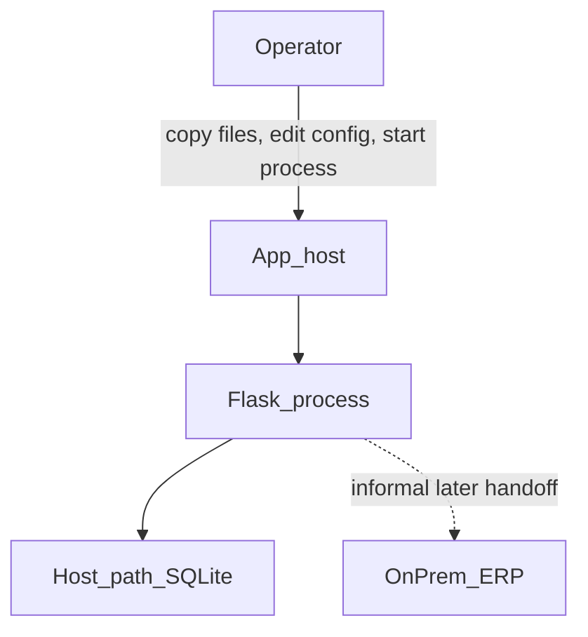
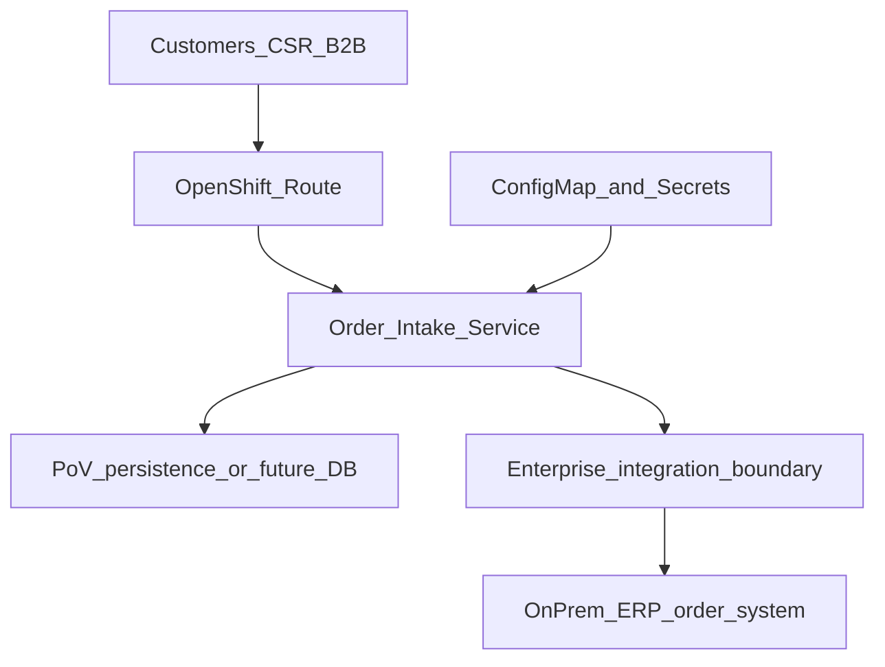

# Hybrid Cloud Modernization Proof-of-Value

A Technical Seller case study for a fictional **Legacy Order Intake Service**.
The work starts with discovery and a Rehost vs Replatform vs Refactor
tradeoff, then replatforms the **operating model** (container, configuration,
health/readiness, OpenShift-compatible deploy, Terraform platform
prerequisites) while leaving on-prem ERP behind an integration boundary.

This is **not** a production migration, **not** an IBM Cloud deployment, and
**not** a live OpenShift cluster apply unless `docs/implementation-status.md`
says a cluster was used.

## Interview narrative

I started with discovery, evaluated modernization options, chose a
replatform PoV instead of forcing a rewrite, and defined measurable
technical and business success criteria.

## Resume mapping

| Resume claim | Where it is evidenced |
|---|---|
| Modernization case study, pain points → hybrid architecture, discovery, design, success criteria | `docs/discovery.md`, `docs/decision-matrix.md`, `docs/success-criteria.md`, architecture below |
| Before/after operating model; standardized infrastructure and containerized deployment | `docs/operating-model.md`, `modernized-app/Dockerfile`, `deploy/openshift/`, `infra/terraform/` |

Technologies used as artifacts: **OpenShift** (Route + workload YAML),
**Terraform** (platform objects), **Docker** (image definition),
**cloud architecture** (hybrid diagram). Runtime claims follow the
status matrix — they are not implied by file presence alone.

## Truthfulness

See [`docs/implementation-status.md`](docs/implementation-status.md).

Labels used: **IMPLEMENTED**, **TESTED**, **ARCHITECTED**, **NOT EXECUTED**.

Intended runtime is **Python 3.12** (`.python-version`, GitHub Actions, container base image). Local pytest on this workstation used **Python 3.14.7**. Python **3.12 application tests** are **TESTED IN CI** (GitHub Actions `validate` #2 on commit `518e3d0`).

Workstation detection for the initial implementation (local binaries):

- Python — present (3.14.7 locally)
- Docker / Podman — absent locally
- Terraform — absent locally
- oc / kubectl — absent → manifests IMPLEMENTED, deploy **NOT EXECUTED**

Observed CI (`validate` #2, commit `518e3d0`): Python 3.12 tests, `docker build`, and `terraform fmt -check` / `init -backend=false` / `validate` are **TESTED IN CI**. A Docker **image build** is not a container deployed to OpenShift. Terraform fmt/init/validate is not `terraform plan` or `terraform apply`. The workflow still does not talk to a cluster or deploy.

### Persistence

| Item | Status |
|---|---|
| SQLite persistence | IMPLEMENTED / TESTED |
| DATABASE_URL abstraction | IMPLEMENTED / TESTED |
| PostgreSQL-ready architecture | ARCHITECTED |
| PostgreSQL runtime | NOT EXECUTED |

SQLAlchemy reads `DATABASE_URL`. That is not a tested PostgreSQL integration.
No Postgres server is required for the demo or for tests.

## Business problem

Northline Industrial (fictional case study) captures orders in a small
Flask service. The service works, but releases are manual, configuration is
host-specific, health is “is the process up?”, rollback is restore-and-hope,
and the ERP cannot leave on-prem in this phase.

Value of the PoV: repeatability, portability, deployment consistency, health
visibility, clearer rollback, less operator dependency, incremental hybrid
modernization. No invented ROI figures.

## Selected strategy: Replatform

Preserve business logic. Improve how the application is packaged, configured,
deployed, and observed. See [`docs/decision-matrix.md`](docs/decision-matrix.md).

## Architecture

### Before



### Target hybrid (application layer first)



IBM Cloud is **not** in this architecture.

### SQLite on OpenShift

The Deployment uses **`replicas: 1`**. SQLite on `emptyDir` is PoV-only and
not HA. Pod replacement may lose ephemeral data. Horizontal scaling requires
external shared persistence. Production database modernization is outside
this PoV.

## What changed vs what did not

Unchanged: `GET /`, `GET /orders`, `POST /orders`, `GET /orders/{id}`,
validation rules, synthetic order records.

Changed: env configuration, `DATABASE_URL`, structured logs, `/health`,
`/ready`, container-friendly paths, Dockerfile, OpenShift manifests,
Terraform platform prerequisites.

## Repository layout

- `legacy-app/` — baseline Flask service and manual `DEPLOY.md`
- `modernized-app/` — replatformed Flask service + Dockerfile
- `deploy/openshift/` — Namespace, ConfigMap, Secret template, Deployment, Service, Route, example NetworkPolicy
- `infra/terraform/` — namespace, quota, platform ConfigMap, service account
- `docs/` — discovery, decision matrix, success criteria, operating model, status
- `scripts/` — environment detection, smoke, validate
- `portfolio-demo/` — recruiter-facing Vite/React walkthrough (not the operational API)
- `.github/workflows/` — local-style validation; no cluster, no cloud credentials

## NetworkPolicy

`deploy/openshift/networkpolicy.yaml` is an **example baseline**. OpenShift
router namespaces/labels and ingress selectors are cluster-specific and
must be validated on the customer platform before apply.

## Local run

### Legacy

```bash
cd legacy-app
python -m venv .venv
.venv\Scripts\activate
pip install -r requirements.txt
python app.py
```

### Modernized (Windows workstation)

```bash
cd modernized-app
python -m venv .venv
.venv\Scripts\activate
pip install -r requirements.txt
python app.py
```

Container images use **gunicorn**. This workstation does not use gunicorn
as the local Windows server.

### Tests

```bash
python -m pytest legacy-app/tests -q
python -m pytest modernized-app/tests -q
python -m pytest tests -q
```

Or: `python scripts/validate_pov.py`

### Portfolio demo

The recruiter UI is `portfolio-demo/` (Vite). It is not the OpenShift runtime.

**Terminal 1 — modernized Flask app (port 8080):**

```bash
cd modernized-app
python -m pip install -r requirements.txt
python app.py
```

**Terminal 2 — portfolio-demo in real mode** (`VITE_DEMO_MODE` unset):

```bash
cd portfolio-demo
npm install
npm run dev
```

Open http://localhost:5173. The Live PoV demo should show **Connected to local modernized application**, then `/health`, `/ready`, create order, and list orders.

**Public / Vercel production:** `VITE_DEMO_MODE=true` (`.env.production`). No Flask, no database, no proxy. Label: **Public deterministic PoV demo**. This is not an OpenShift deployment.

Do not deploy to Vercel unless explicitly requested.

## IBM alignment

Relevant to how IBM and Red Hat talk about **Red Hat OpenShift**, **hybrid
cloud**, **application modernization**, **infrastructure as code**, and
**proof-of-value** selling: start with discovery, pick a bounded first
increment, show operating-model improvement, keep immovable systems honest.

This repository does **not** claim:

- live IBM Cloud infrastructure
- IBM Consulting involvement
- a production OpenShift deployment
- live IBM product integrations
